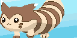
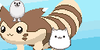
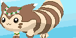
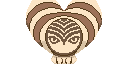
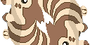
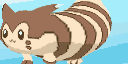
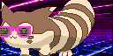
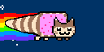
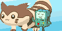
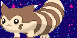

# Finalized animations

The original pixel art animation was done by the extremely talented [Alex Illustration](https://www.artstation.com/alexillustration)! My wife and I modified the basic animation in Photoshop to make all the other animations!

The animations with transparent (dynamically generated) backgrounds aren't *perfectly* re-created here, but you get the idea!

Here they are, sorted by when they were added to the animation pool!

## v0.1

## ABGT Weekender 2019

## Shambhala 2019

## Burning Man 2019
Ran out of time! 😅

## Alchemy Tour 2019

## Dreamstate SoCal 2019

# Limitations
* SPIFFS filenames can't be too long, or files will not upload. (Move to FatFS!)
* Little color variety: due to memory constraints on ESP32 with 128x64px, use < 32 colors
* Short looped animations: due to memory constraints on ESP32 with 128x64px, use < 20 frames total (or is it < 20kB filesize?)

# Future design philosophy
* Allow every animation to have 3 phases: 1 and 3 are optional and play once.  2 loops as long as needed.
  1. intro
  2. loop
  3. outro
  
* transparent backgrounds (alpha layer) are allowed so we can change/generate the backgrounds

# Future Animation ideas

* Furret eats a berry and then his eyes change (ditto or dilated pupils?) and he grows a smile
* the worm?
* ditto furret face
* additional crops for furret walking video
* add a microphone and do beat analysis.  adjust frame delay until furret walking lines up with the beat.
