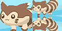
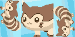
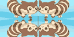
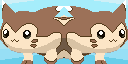
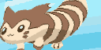
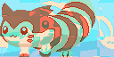
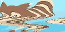
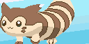
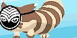

# Finalized animations
Some of these have transparent backgrounds, which only show up as white here. Usually this transparency is filled with moving rainbow gradients on the real totem.

# Limitations
* SPIFFS filenames can't be too long, or files will not upload.
* Little color variety: due to memory constraints on ESP32 with 128x64px, use < 32 colors
* Short looped animations: due to memory constraints on ESP32 with 128x64px, use < 20 frames total (or is it < 20kB filesize?)

# Desired design
* Allow every animation to have 3 phases: 1 and 3 are optional and play once.  2 loops as long as needed.
  1. intro
  2. loop
  3. outro
  
* transparent backgrounds (alpha layer) are allowed so we can change/generate the backgrounds

# Animation ideas

* Furret eats a berry and then his eyes change (ditto or dilated pupils?) and he grows a smile
* the worm?
* ditto furret face
* additional crops for furret walking video
* add a microphone and do beat analysis.  adjust frame delay until furret walking lines up with the beat.